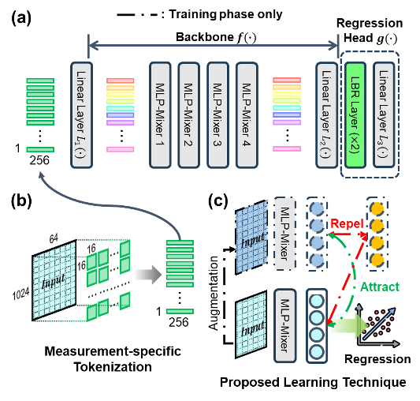

<p align="center">

</p>

# Contrastive_Mixer



Authors: Eunseob Kim, [Hojun Lee](https://kidpaul94.github.io/), [Yuseop Sim](https://yuseopsim.github.io), [Jiho Lee](https://www.jiholee.xyz/people), [Martin B.G. Jun](https://web.ics.purdue.edu/~jun25/members.html)

[](https://opensource.org/licenses/MIT)

Contrastive Mixer (CM) model to predict Remaining Useful Life (RUL) of a machine tool. We fuse [SimCLR](https://arxiv.org/pdf/2002.05709), [MLP-Mixer](https://arxiv.org/pdf/2105.01601), and a stethoscope-based sound sensor to found a framework for RUL prediction of plasma nozzles attahced on a Plasma Arc Cutting (PAC) tool 

## Table of Contents

- [Download Process](#download-process)
- [ToDo Lists](#todo-lists)
- [How to Run](#how-to-run)
    - [Training](#training)
    - [Inference](#inference)

## Download Process

    git clone https://github.com/purduelamm/Contrastive_Mixer.git
    cd Contrastive_Mixer/
    pip3 install -r requirements.txt

## How to Run
Contrastive Mixer (CM) requires 2-steps to train (1) Backbone and (2) Head. Below are code snippets to completely train CM.

### Training:

> [!NOTE]
`train_supcon.py` and `train_reg.py` receive several different arguments. Run the `--help` command to see everything they receive.

    python3 train_supcon.py # training process for the backbone
    python3 train_reg.py # training process for the backbone

### Inference:

    python3 eval_supcon.py # inference using the backbone
    python3 eval_reg.py # inference using the head

## Citation
If you found Contrastive Mixer useful in your research, please consider citing:

```plain
@article{kim2025overcoming,
  title={Overcoming sparse run-to-failure data challenges in manufacturing: A contrastive mixer framework for remaining useful life prediction},
  author={Kim, Eunseob and Lee, Hojun and Sim, Yuseop and Lee, Jiho and Jun, Martin BG},
  journal={CIRP Annals},
  volume={74},
  number={1},
  pages={579--583},
  year={2025},
  publisher={Elsevier}
}
```

## ToDo Lists

| **Documentation** |  |
| --- | --- |
